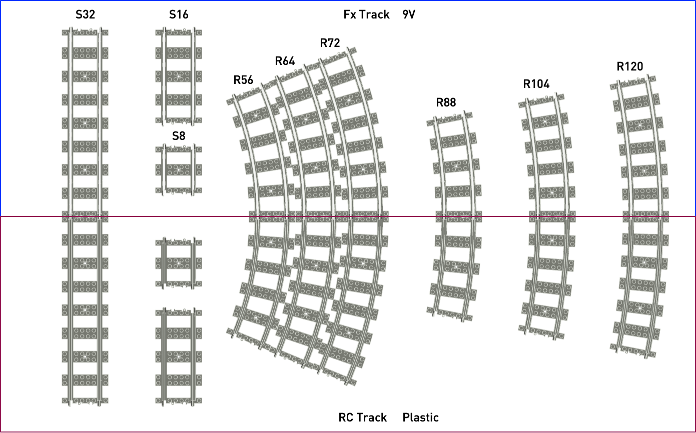
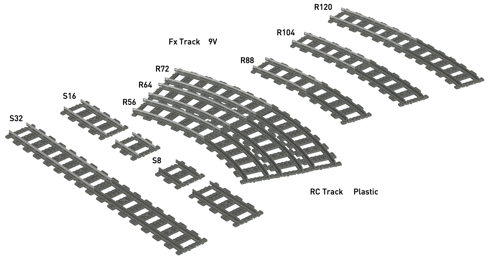
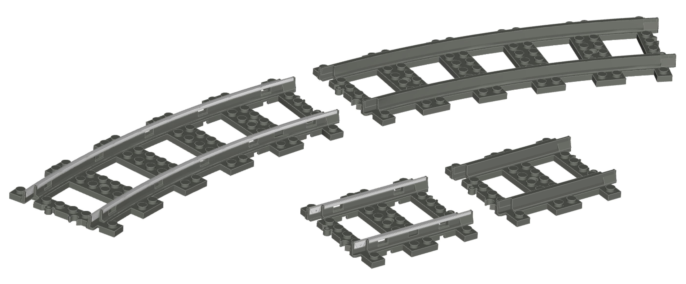

# pfx-ldraw-models


This repository contains LDraw 3D models of the PFx Brick, speakers, and sub-assemblies. These model files can be used with any LDraw compatible CAD application or generate high quality renders for instructions and illustrations.

## Installation

The contents of the `ldraw` folder can be copied into your LDraw installation folder's `Unofficial/parts` folder.

For example, for Bricksmith users on macOS, add the Fx Bricks LDraw parts as follows:

```shell
    $ git clone https://github.com/fx-bricks/pfx-ldraw-models.git
    $ cd pfx-ldraw-models
    $ cp -R ldraw/* /Applications/Bricksmith/ldraw/Unofficial/parts
```

Make sure to reload/re-index the parts library in any tool that uses your LDraw installation.

## Track Elements







## Changelog

- Oct 2020: Added new PFx Brick V2 (injection molded PFx Brick) and XL Speaker Brick V2 (injection molded)


- Nov 2020: Added detailed RC plastic track and metal/9V Fx Track elements
  

